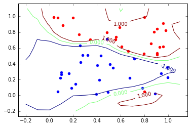
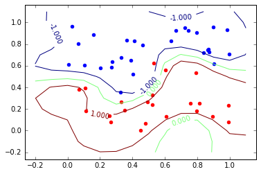
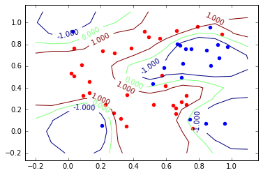

# Sampling from an SVM
What does a Support Vector Machine think data looks like? Here are a few samples:

 There's a bayesian interpretation of SVMs (due to Peter Sollich http://web.cs.iastate.edu/~honavar/bayes-svm.pdf), as MAP solutions to inference problems with priors determined by a choice of gaussian process. In the [accompanying notebook](Support_Vector_Machine_Samples.ipynb) we sample from this prior. The above samples were generated from a Squared Exponential gaussian process. 